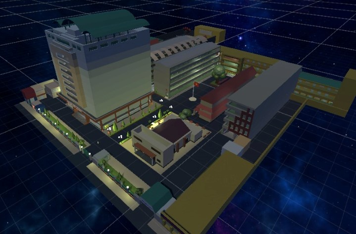

# UniMap Project

3D model of HCMUS created with Unity Probuilder



This repository provides source code for UniMap game which was posted in the following [Facebook URL](https://www.facebook.com/bai.thang.5055/posts/1239067133626032).  

Gitlab URL of source code: https://gitlab.com/leminhtu74/unimap_1.1.

This is an open-source project so feel free when using it in your own project. And we appreciate it if you cite and share our project with others.

# Citation

## APA

```
Le, M. T., Do Nguyen, D. H., & Do, H. N. UniMap [Computer software]. https://github.com/egliette/UniMap
```

## BibTex

```
@software{Le_UniMap,
author = {Le, Minh Tu and Do Nguyen, Duy Hoang and Do, Hoai Nam},
title = {{UniMap}},
url = {https://github.com/egliette/UniMap}
}
```
